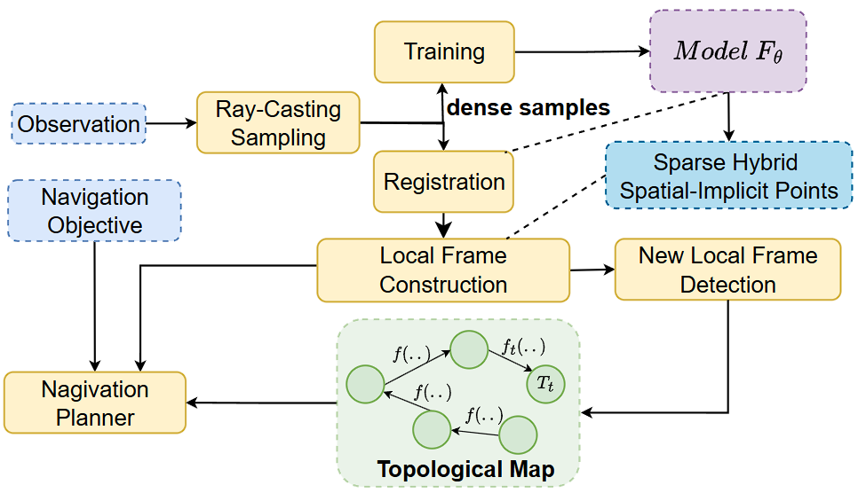

# Bio-inpired Spatial Implicit Maps System for Navigation

## Authors:
- Tuan Dang
    - Email: tuan.dang@uta.edu or dangthanhtuanit@gmail.com
    - Website: [www.tuandang.info](www.tuandang.info)

- Mandfred Huber
    - Email: huber@cse.uta.edu
    - Website: [https://www.uta.edu/academics/faculty/profile?user=huber](https://www.uta.edu/academics/faculty/profile?user=huber)


## Astract
Navigation is a fundamental capacity for mobile robots, enabling them to operate autonomously in complex and dynamic environments. Conventional approaches use probabilistic models to localize robots and build maps simultaneously using sensor observations. Recent approaches employ human-inspired learning, such as imitation and reinforcement learning, to navigate robots more effectively. However, these methods suffer from high computational costs, global map inconsistency, and poor generalization to unseen environments. This paper presents a novel method inspired by how humans perceive and navigate themselves effectively in novel environments. Specifically, we first build spatial-implicit local frames that mimic how humans represent essential spatial information in the short term. Then, we integrate spatial-implicit local frames into the global topological map represented as a factor graph. Lastly, we developed a novel navigation algorithm based on Rapid-Exploring Random Tree Star (RRT*) that leverages spatial-implicit maps and the topological map to navigate effectively in environments. Lastly, we conduct extensive experiments in real-world datasets and in-lab environments to validate our approach.

# Overview
<p align="center">
    <br/>
</p>


## Environment and dependencies setup
``` shell
conda create -n simn python=3.10.16 # create new environment
conda activate simn # activate the new environment
conda install pytorch==2.0.0 torchvision==0.15.0 torchaudio==2.0.0 pytorch-cuda=11.7 -c pytorch -c nvidia 
python -r requirements.txt # install dependencies
```

### Full demo is available at [YouTube](https://youtu.be/tBR_HZLbYn4).

<p align="center">
   <br/>
   <!-- <i>Baxter is mounted with Intel RealSense D435i RGB-D</i> -->
</p>


## Configurations
Examples: config/tum_fr1_desk.yaml
```yaml
camera:
  fx: 520.9
  fy: 521.0
  cx: 325.1
  cy: 249.7
  fps: 30
```
Cogfigurations are stored as yaml file, then converted into a configured object:

``` Python

cfg = Config(path="config/tum_fr1_desk.yaml").config()
camera= cfg.camera # Access a complex property
fps = camera.fps   # Acess single property
```

### Run
``` shell
python main.py -c config/tum_fr1_desk.yaml
```

### Datasets
- Tum
- Realsense Camera (Real-time on device)
- UT Arlington
- Kitti

### Realsense Installation
#### Install driver and tools
https://github.com/IntelRealSense/librealsense/blob/development/doc/distribution_linux.md
#### Python Binding:
```
pip install pyrealsense2
```